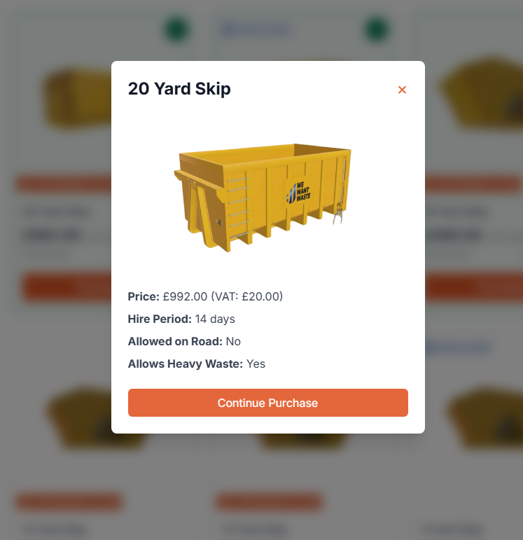

# Skip Container Rental Application

A modern, responsive React application for skip container rental services built with TypeScript, Vite, and Tailwind CSS.


    

## Live Demo

**[Live Preview](https://remwaste.artan.dev/)** | **[CodeSandbox](https://codesandbox.io/p/github/artanvrajolli/remwaste/main)**

Experience the application live with full functionality including product browsing, cart management, and payment flow.

## Overview

This application provides a comprehensive e-commerce solution for skip container rentals, featuring a product catalog, shopping cart functionality, and payment processing interface. The application fetches real-time data from the WeWantWaste API and provides users with an intuitive interface to browse, filter, and purchase skip containers.

## Key Features

### Product Management
- **Dynamic Product Catalog**: Fetches skip container data from external API
- **Real-time Filtering**: Filter by heavy waste capability, road allowance, and price range
- **Advanced Sorting**: Sort products by name, price, or hire period with ascending/descending options
- **Product Details Modal**: Comprehensive product information with purchase flow

### Shopping Cart System
- **Context-based State Management**: Global cart state using React Context API
- **Persistent Cart**: Maintains cart state across page interactions
- **Quantity Management**: Add, remove, and update item quantities
- **Real-time Updates**: Live cart total and item count updates

### Payment Integration
- **Multi-step Checkout**: Product info → Payment details flow
- **Payment Methods**: Credit card and Google Pay integration ready
- **Form Validation**: Complete payment form with security features

### User Interface
- **Responsive Design**: Mobile-first approach with Tailwind CSS
- **Modern UI Components**: Flowbite React component library
- **Accessibility**: ARIA labels, keyboard navigation, and screen reader support
- **Visual Feedback**: Loading states, hover effects, and smooth transitions

## Technical Architecture

### Frontend Stack
- **React 19.1.0**: Latest React with concurrent features
- **TypeScript 5.7.3**: Type-safe development with strict configuration
- **Vite 6.2.6**: Fast build tool and development server
- **Tailwind CSS 4.1.4**: Utility-first CSS framework with @tailwindcss/vite plugin
- **Flowbite React 0.11.7**: Pre-built component library with custom theming
- **React Icons 5.5.0**: Comprehensive icon library

### State Management
- **React Context API**: Centralized cart state management
- **useReducer**: Complex state logic for cart operations with immutable updates
- **Custom Hooks**: Reusable cart functionality with TypeScript interfaces
- **Event Handling**: Proper event propagation and state synchronization

### Design System
- **Custom Brand Theme**: Consistent #e15726 orange color scheme throughout
- **Google Fonts Integration**: Inter font family for modern typography
- **Flowbite Theme Customization**: Extended component styling with brand colors
- **Responsive Breakpoints**: Mobile-first design with Tailwind CSS utilities

### Data Flow
The application follows a unidirectional data flow pattern from the WeWantWaste API through the ProductGrid component to individual ProductCards, with cart state managed through React Context and reflected in the Header and CartModal components. When the API fails, the system automatically falls back to static data to ensure continuous functionality.

## Project Structure

The application follows a well-organized component-based architecture:

**Components Directory**: Contains all reusable UI components including CartModal, PaymentModal, ProductCard, ProductFilter, ProductGrid, ProductInfoModal, and ProductModal for shopping cart overlay, payment interface, product displays, filtering controls, main layout, and modal management respectively.

**Layout Directory**: Houses the Header component providing navigation with cart icon and branding.

**Context Directory**: Manages global cart state using React Context API with TypeScript for type-safe state management.

**Utils Directory**: Contains API integration utilities with fallback mechanisms and utility exports.

**Root Files**: Include main application component (App.tsx), entry point with theme provider (main.tsx), global styles with Google Fonts and Tailwind imports (index.css), and Vite environment type definitions.

### Configuration Files
The project includes Flowbite React configuration files for component library setup and generated Tailwind class lists for optimal styling.

## Development Approach

### Component Design Philosophy
- **Single Responsibility**: Each component has a focused purpose
- **Composition over Inheritance**: Building complex UIs from simple components
- **Props Interface**: Well-defined TypeScript interfaces for all components
- **Event Handling**: Proper event propagation and state updates

### State Management Strategy
- **Centralized Cart State**: Using React Context for global cart management
- **Immutable Updates**: Pure reducer functions for predictable state changes
- **Type Safety**: Full TypeScript coverage for state and actions

### API Integration
- **REST API**: Integration with WeWantWaste skip container API
- **Automatic Fallback**: Graceful fallbacks with static data on API failures
- **Error Handling**: Comprehensive error boundaries and user feedback
- **Data Transformation**: Converting API responses to application models
- **Loading States**: Visual feedback during data fetching operations

### Styling Approach
- **Utility-First CSS**: Tailwind CSS 4.x with modern @tailwindcss/vite plugin
- **Custom Brand Theme**: Consistent #e15726 orange color palette
- **Google Fonts**: Inter font family integration for modern typography
- **Responsive Design**: Mobile-first breakpoints and adaptive layouts
- **Component Variants**: Conditional styling based on state and props
- **Flowbite Integration**: Pre-built components with extensive customization

## Getting Started

### Prerequisites
- Node.js 18+ 
- npm or yarn package manager
- Modern web browser with ES2020 support

### Installation
Clone the repository, navigate to the project directory, then install dependencies and start the development server using standard npm commands.

### Available Scripts
The project includes several npm scripts: `dev` for starting the development server, `build` for production builds, `preview` for previewing builds, `lint` for ESLint checking, `format` for code formatting with Prettier, and `format:check` for checking code formatting.

## Features in Detail

### Product Filtering System
The application provides comprehensive filtering options:
- **Heavy Waste Toggle**: Filter containers that accept heavy waste
- **Road Allowance**: Hide containers not allowed on public roads
- **Price Range**: Set minimum and maximum price filters
- **Real-time Updates**: Instant filtering without page reload

### Shopping Cart Functionality
- **Add to Cart**: One-click addition with visual feedback
- **Quantity Management**: Increment/decrement with bounds checking
- **Remove Items**: Individual item removal with confirmation
- **Cart Persistence**: Maintains cart state during session
- **Total Calculation**: Automatic price and quantity totals

### Responsive Design
- **Mobile Optimized**: Touch-friendly interface for mobile devices
- **Tablet Support**: Optimal layouts for medium screen sizes
- **Desktop Enhanced**: Full-featured experience on large screens
- **Cross-browser**: Compatible with modern browsers

### Visual Design & Branding
- **REM Waste Branding**: Professional logo integration and brand consistency
- **Custom Color Scheme**: Primary orange (#e15726) with complementary grays
- **Inter Typography**: Modern Google Fonts integration for improved readability
- **Visual Hierarchy**: Clear information architecture and user flow
- **Interactive Feedback**: Hover states, transitions, and loading indicators

## Modal Components

The application features four primary modal interfaces that provide seamless user interactions:

### Product Information Modal


The product details modal displays comprehensive information for each skip container:
- **Product Visualization**: High-quality 3D container images with clear branding
- **Pricing Details**: Base price with VAT breakdown for transparency
- **Rental Terms**: Clear hire period display for standard rental duration
- **Usage Specifications**: 
  - Road allowance status (clearly marked when not permitted)
  - Heavy waste acceptance capability (Yes/No indicators)
- **Purchase Flow**: Direct "Continue Purchase" button for streamlined checkout
- **Modal Controls**: Clean close button (×) with smooth animations

### Shopping Cart Modal


The shopping cart provides comprehensive order management:
- **Item Display**: Thumbnail images with product names and rental periods
- **Quantity Controls**: Intuitive +/- buttons with real-time price updates
- **Individual Pricing**: Per-item costs clearly displayed for each container type
- **Remove Functionality**: Red trash icon for individual item removal
- **Order Summary**: 
  - Total items count display
  - Grand total calculation with automatic updates
- **Action Buttons**: 
  - Clear Cart (removes all items)
  - Continue Shopping (returns to catalog)
  - Checkout (proceeds to payment)

### Payment Details Modal


The payment interface supports multiple payment methods:
- **Payment Method Tabs**: 
  - Credit/Debit Card (primary)
  - Google Pay integration ready
- **Secure Form Fields**:
  - Card number with format validation and proper masking
  - Expiration date (MM/YY format)
  - Security code (CVC) with icon indicator
- **Billing Information**: Country selection dropdown with regional support
- **Payment Options**: 
  - Save card checkbox for future purchases
  - Complete Payment button for final submission
- **Navigation**: Back button to return to previous step

### Product Grid Overview


The main product catalog displays the complete skip container range:
- **Product Grid Layout**: Responsive 4-column layout on desktop
- **Size Variations**: Complete range from small to large yard containers
- **Visual Consistency**: Uniform product cards with consistent branding
- **Pricing Display**: Clear pricing with VAT information for transparency
- **Filtering Controls**: Left sidebar with multiple filter options
- **Status Indicators**: 
  - "Not allowed on road" warnings where applicable
  - "Heavy waste" capability badges
- **Interactive Elements**: 
  - Purchase buttons on each card
  - Add to cart functionality (+/- controls)
  - "In Cart" status indicators

### Modal Design Principles
- **Accessibility**: Full keyboard navigation and screen reader support
- **Responsive Design**: Optimized for mobile, tablet, and desktop viewports
- **User Experience**: Clear hierarchy, consistent actions, and smooth transitions
- **Brand Consistency**: REM Waste branding with #e15726 orange accent color
- **Performance**: Lazy loading for modal content and optimized re-renders

## API Integration

### Data Source
The application integrates with the WeWantWaste API with automatic fallback:
```
Primary Endpoint: https://app.wewantwaste.co.uk/api/skips/by-location
Parameters: postcode=NR32&area=Lowestoft
Fallback: Static data array with 9 skip container types
```

### API Response Handling
- **Primary Data Source**: Live API with real-time pricing
- **Automatic Fallback**: Static data on API failure or network issues
- **Error Recovery**: Retry mechanism with user-friendly error messages
- **Data Validation**: Type-safe response processing with TypeScript

### Data Transformation
Raw API data is transformed into a standardized format with consistent property naming and type safety. The transformation process converts API response fields to application-friendly interfaces, ensuring reliable data structure across the application.

### Fallback Data
The application includes comprehensive fallback data covering:
- Multiple skip container sizes from small to large capacity
- Varied pricing structure across different container types
- Mixed road allowance and heavy waste capabilities
- Consistent hire periods for rental planning

## Configuration

### TypeScript Configuration
- **Strict Mode**: Enabled for maximum type safety and error prevention
- **Modern Target**: ES2020 for optimal performance and feature support
- **Bundler Mode**: Optimized for Vite with advanced module resolution
- **Linting Rules**: Comprehensive rules for unused variables and parameters
- **Build Optimization**: Separate app and node configurations for optimal builds

### Build Configuration (Vite)
- **React Plugin**: Fast refresh and JSX transformation
- **Tailwind CSS Plugin**: Modern @tailwindcss/vite integration
- **Flowbite React Plugin**: Component library integration and optimization
- **TypeScript Integration**: Full type checking during development and build
- **Asset Optimization**: Automatic image compression and lazy loading

### Tailwind CSS Configuration
- **Custom Color Palette**: Brand colors including blue, purple, and gray spectrums
- **Typography**: Inter font family integration for modern design
- **Utility Classes**: Extended utilities for enhanced styling flexibility

### Flowbite React Theme
- **Button Variants**: Custom primary, secondary, and gray button styles
- **Brand Colors**: Consistent orange (#e15726) theme integration
- **Component Customization**: Extended theme configuration for all UI components

### ESLint Configuration
- **TypeScript ESLint**: Advanced TypeScript-specific linting rules
- **React Hooks Rules**: Enforces rules of hooks and React best practices
- **React Refresh**: Development-time component refresh optimization
- **Modern JavaScript**: ES2020 syntax support and browser globals

## Deployment

The application is ready for deployment to modern hosting platforms with optimized builds:

### Build Process
The application uses a production build process with TypeScript compilation and Vite optimization. Use `npm run build` to create optimized production assets and `npm run preview` to preview the build locally.

### Build Output
- **Optimized Assets**: Minified JavaScript, CSS, and images
- **Code Splitting**: Automatic chunk splitting for optimal loading
- **TypeScript Compilation**: Full type checking before build
- **Tree Shaking**: Dead code elimination for smaller bundles

### Static Hosting Platforms
Compatible with modern hosting services:
- **Vercel**: Zero-config deployment with automatic optimizations
- **Netlify**: Continuous deployment with branch previews
- **GitHub Pages**: Static hosting with GitHub Actions
- **AWS S3 + CloudFront**: Enterprise-grade CDN distribution
- **Azure Static Web Apps**: Integrated with GitHub workflows

### Environment Requirements
- **Node.js 18+**: For build process and dependencies
- **Modern Browsers**: ES2020 support required
- **HTTPS**: Recommended for security and performance features

## Quality Assurance

### Code Quality Tools
- **ESLint 9.24.0**: Modern JavaScript/TypeScript linting with flat config
- **Prettier 3.5.3**: Code formatting with Tailwind CSS plugin
- **TypeScript 5.7.3**: Static type checking with strict configuration
- **React Hooks Rules**: React-specific linting and best practices enforcement

### Development Tools Integration
- **Prettier Plugin**: Tailwind CSS class sorting and formatting
- **TypeScript ESLint**: Advanced TypeScript linting with modern rules
- **Flowbite React Patching**: Automatic component library optimization

### Best Practices Implemented
- **Accessibility**: ARIA labels, semantic HTML, and keyboard navigation
- **Performance**: Lazy loading, error boundaries, and optimized re-renders
- **Security**: XSS prevention, safe API calls, and input validation
- **SEO**: Semantic markup, meta tags, and proper document structure
- **Error Handling**: Comprehensive error boundaries and user feedback
- **Type Safety**: Full TypeScript coverage with strict configuration

## Future Enhancements

### Planned Features
- **User Authentication**: Login system with user profiles and order history
- **Advanced Search**: Location-based skip availability and GPS integration
- **Payment Gateway**: Real Stripe/PayPal integration with secure processing
- **Inventory Management**: Real-time stock levels and availability tracking
- **Booking System**: Scheduled delivery and pickup time slots
- **Customer Portal**: Order tracking, invoice management, and support tickets
- **Multi-location Support**: Expanded geographic coverage and pricing

### Technical Improvements
- **Progressive Web App**: Offline functionality, push notifications, and app installation
- **Testing Framework**: Comprehensive unit, integration, and E2E test suites
- **Performance Monitoring**: Real User Monitoring (RUM) and error tracking
- **API Caching**: Redis/CDN integration for improved data loading
- **Internationalization**: Multi-language support and localization
- **Advanced Analytics**: User behavior tracking and business intelligence
- **Microservices**: Backend API modernization and scalability improvements


## Contributing

This project follows modern React development practices and welcomes contributions:

### Development Guidelines
1. **TypeScript First**: Use TypeScript for all new components and utilities
2. **Component Architecture**: Follow the existing single-responsibility pattern
3. **Error Boundaries**: Implement proper error handling and user feedback
4. **Accessibility**: Add ARIA labels, semantic HTML, and keyboard navigation
5. **Responsive Design**: Write mobile-first styles with Tailwind CSS utilities
6. **Performance**: Consider lazy loading, memoization, and optimization

### Code Standards
- **ESLint Configuration**: Follow the established linting rules
- **Prettier Formatting**: Use automatic code formatting with Tailwind plugin
- **TypeScript Strict Mode**: Maintain full type safety and strict checking
- **Component Testing**: Add unit tests for new components and utilities
- **Documentation**: Update README and add JSDoc comments for complex functions

## Acknowledgments

### Core Technologies
- **[React](https://react.dev/)**: Modern UI library with concurrent features
- **[TypeScript](https://www.typescriptlang.org/)**: Type-safe JavaScript development
- **[Vite](https://vitejs.dev/)**: Lightning-fast build tool and development server
- **[Tailwind CSS](https://tailwindcss.com/)**: Utility-first CSS framework
- **[Flowbite React](https://flowbite-react.com/)**: Professional UI component library

### API & Data
- **[WeWantWaste API](https://app.wewantwaste.co.uk/)**: Skip container data provider
- **[React Icons](https://react-icons.github.io/react-icons/)**: Comprehensive icon library

### Development Tools
- **[ESLint](https://eslint.org/)**: Code quality and consistency
- **[Prettier](https://prettier.io/)**: Automatic code formatting
- **[Google Fonts](https://fonts.google.com/)**: Inter font family integration

### Special Thanks
- **REM Waste**: Brand identity and business requirements
- **Flowbite Team**: Excellent React component library and documentation
- **Tailwind Labs**: Revolutionary approach to CSS development
- **React Team**: Continued innovation in UI development

---
*Last updated: June 2025*
